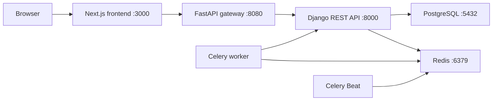

# EduMetric CRM - Full System Report

Date: 2026-05-21  
Project path: `/Users/muhammadnur/Desktop/PDP University/Projects/edu-metric-crm`

## Executive Summary

EduMetric CRM is a PDP University grant/rating management system built as a small service-oriented application:

- Backend: Django 5.1 + Django REST Framework
- Frontend: Next.js 15 + React 19 + Tailwind CSS
- Gateway: FastAPI reverse proxy
- Infrastructure: PostgreSQL 16, Redis 7, Celery worker, Celery Beat, Docker Compose

The core domain is student grant scoring. The system collects academic results, attendance, assignments, activities, tutor/mentor evaluations, discipline, penalties/recovery, and employment bonuses, then calculates a ranked grant score.

Overall status: the backend domain model and API structure are coherent, but the frontend and backend currently have several response-field mismatches. The project also needs dependency installation before local frontend builds can run.

## Repository Structure

High-level layout:

```text
.
├── docker-compose.yml
├── README.md
├── SYSTEM_REPORT.md
└── services
    ├── backend
    ├── frontend
    └── gateway
```

Observed file count excluding `.git` and frontend `node_modules`: 2469 files.

Application modules:

- `services/backend`: Django API and business logic
- `services/frontend`: Next.js web UI
- `services/gateway`: FastAPI gateway/proxy

Backend apps count: 9.

Frontend page count: 16 `page.tsx` routes.

## Technology Stack

### Backend

- Django 5.1.4
- Django REST Framework 3.15.2
- SimpleJWT 5.4.0
- django-filter
- django-cors-headers
- django-environ
- django-redis
- django-celery-beat
- drf-spectacular
- Celery 5.4.0
- PostgreSQL driver: psycopg2-binary
- Gunicorn
- Pillow

### Frontend

- Next.js 15.1.0 dependency, with installed config referring to Next 16.2.6 ESLint package
- React 19
- TypeScript 5.7
- Tailwind CSS 3.4
- Radix UI primitives
- lucide-react
- Recharts
- shadcn-style UI components under `src/components/ui`

### Gateway

- FastAPI
- httpx
- pydantic-settings

### Infrastructure

- PostgreSQL 16 Alpine
- Redis 7 Alpine
- Docker Compose services:
  - `db`
  - `redis`
  - `backend`
  - `celery`
  - `celery-beat`
  - `gateway`
  - `frontend`

## Runtime Architecture



The frontend calls:

```text
NEXT_PUBLIC_API_URL=http://10.50.2.39:8080/api/v1
```

The gateway proxies:

```text
/api/v1/{path} -> backend /api/v1/{path}
/api/schema/* -> backend /api/schema/*
/api/docs/* -> backend /api/docs/*
```

## Backend System

### Settings

Main settings file:

```text
services/backend/config/settings/base.py
```

Important settings:

- `AUTH_USER_MODEL = "accounts.User"`
- JWT authentication is enabled globally.
- Default permission is authenticated access.
- Pagination uses `PageNumberPagination` with page size 20.
- API schema uses `drf-spectacular`.
- Language: `uz`
- Time zone: `Asia/Tashkent`
- Redis is used for cache and Celery broker/result backend.

Environment file currently contains development secrets:

```text
SECRET_KEY=django-insecure-change-me-in-production-2026
DEBUG=True
ALLOWED_HOSTS=*
DATABASE_URL=postgres://grant_user:grant_pass_2026@db:5432/grant_management
```

This is acceptable for local development but must not be used as-is in production.

### URL Map

Backend base API:

```text
/api/v1/auth/
/api/v1/academic/
/api/v1/attendance/
/api/v1/assignments/
/api/v1/activities/
/api/v1/grants/
/api/v1/penalties/
/api/v1/evaluations/
/api/schema/
/api/docs/
```

### Domain Modules

#### Accounts

Models:

- `User`
- `StudentProfile`
- `ActivityLog`

Roles:

- `admin`
- `teacher`
- `tutor`
- `komendant`
- `manager`
- `parent`
- `student`

Auth capabilities:

- Username/password JWT login
- Phone/password login
- Current user endpoint
- Parent child lookup endpoint

Important endpoints:

```text
POST /api/v1/auth/token/
POST /api/v1/auth/token/refresh/
POST /api/v1/auth/phone-login/
GET  /api/v1/auth/users/me/
GET  /api/v1/auth/my-children/
```

#### Academic

Models:

- `Semester`
- `Subject`
- `AcademicRecord`

Academic score formula:

```text
(GPA percentage / 100) * 40
Max: 40
```

#### Attendance

Models:

- `AttendanceRecord`
- `AttendanceSummary`

Attendance score formula:

```text
(attendance percentage / 100) * 20
Max: 20
```

Supports bulk attendance creation.

#### Assignments

Models:

- `Assignment`
- `AssignmentSubmission`
- `AssignmentScore`

Assignment aggregate score:

```text
(average submission score / 100) * 15
Max: 15
```

Note: plagiarism forces score to 0 and marks submission as not independent.

#### Activities

Models:

- `Activity`
- `ActivityScore`

Activity categories include competitions, startup, mentoring, PDP/national/language/international certificates, volunteering, soft skills, networking, and project/assistant roles.

Aggregate activity score max:

```text
10
```

#### Evaluations

Models:

- `TutorEvaluation`
- `MentorFeedback`
- `DisciplineRecord`

Tutor evaluation max:

```text
5
```

Discipline max:

```text
10
```

#### Penalties

Models:

- `Penalty`
- `Recovery`
- `PenaltySummary`

Penalty/recovery rules:

- Penalties are negative, capped at `-20`.
- Recovery is capped at 50% of penalty absolute value and max `+10`.
- Net penalty is penalty plus recovery.

#### Grants

Models:

- `GrantScore`
- `EmploymentRecord`
- `GrantAllocation`

Grant score components:

| Component | Max |
|---|---:|
| Academic | 40 |
| Attendance | 20 |
| Assignments | 15 |
| Activities | 10 |
| Tutor evaluation | 5 |
| Discipline | 10 |
| Base total | 100 |
| Penalty | -20 |
| Recovery | +10 |
| Employment | +10 |

Final score formula:

```text
base_total + penalty_score + recovery_score + employment_score
Minimum final score: 0
```

GPA eligibility:

```text
gpa_percentage >= 80
```

Ranking is recalculated by ordering `GrantScore` by `final_score` descending.

## Frontend System

Main frontend routes observed:

- `/`
- `/login`
- `/rating`
- `/dashboard`
- `/dashboard/students`
- `/dashboard/academic`
- `/dashboard/attendance`
- `/dashboard/assignments`
- `/dashboard/activities`
- `/dashboard/grants`
- `/dashboard/penalties`
- `/dashboard/recovery`
- `/dashboard/evaluations`
- `/dashboard/discipline`
- `/dashboard/employment`
- `/dashboard/feedback`

The frontend uses a central API client:

```text
services/frontend/src/lib/api.ts
```

Features:

- JWT stored in `localStorage`
- Automatic refresh on 401
- Phone login support
- Username login support
- User role extracted from JWT payload

## Gateway System

Main file:

```text
services/gateway/app/main.py
```

Capabilities:

- Health endpoint: `/health`
- Backend reachability endpoint: `/health/backend`
- Generic API proxy for `/api/v1/*`
- Schema/docs proxy
- Global CORS allow-all

Potential issue:

- `/health/backend` calls `/api/v1/auth/users/me/` without auth, so a reachable backend may return 401. The endpoint labels this as reachable, which is okay, but operational dashboards should interpret `backend_status: 401` as backend reachable, not unhealthy.

## Data Seeding

Seed command:

```bash
python manage.py seed_data
```

It creates:

- Admin, teachers, tutors, komendants, manager, parents
- Students across groups
- Semester and subjects
- Academic records
- Attendance
- Assignments/submissions
- Activities
- Evaluations
- Penalties/recoveries
- Employment records
- Calculated grant scores

Default seed password:

```text
test1234
```

Important seeded usernames:

```text
admin
teacher1
teacher2
teacher3
tutor1
tutor2
komendant1
komendant2
manager1
parent1
parent2
parent3
parent4
student1 ... studentN
```

## Verification Performed

### Python compile check

Command:

```bash
python3 -m compileall -q services/backend services/gateway
```

Result:

```text
Passed
```

This confirms Python syntax is valid across backend and gateway files.

### Frontend build check

Command:

```bash
npm run build
```

Result:

```text
Failed: sh: next: command not found
```

Reason:

```text
Frontend dependencies are not installed in services/frontend/node_modules.
```

Next step:

```bash
cd services/frontend
npm install
npm run build
```

### Docker Compose config check

Command attempted:

```bash
docker compose config --quiet
```

Result:

```text
Failed: unknown flag: --quiet
```

The Docker CLI available in this environment did not accept the Compose v2 flag as used. Re-run with:

```bash
docker compose config
```

or, if using legacy Compose:

```bash
docker-compose config
```

## Key Issues And Risks

### 1. Frontend/backend field mismatch in attendance

Frontend expects:

```text
present_count
absent_count
late_count
excused_count
attendance_percentage
attendance_score
semester_name
```

Backend `AttendanceSummarySerializer` returns:

```text
total_classes
attended_classes
percentage
score
semester
```

Impact:

- Attendance dashboard will show undefined/blank values unless adapted.

Recommended fix:

- Either update frontend to use backend fields, or add compatibility fields in serializer.

### 2. Frontend/backend field mismatch in assignments

Frontend expects fields such as:

```text
assignment_type
status
quality_score
deadline_score
independence_score
total_score
graded_by_name
```

Backend `AssignmentSubmissionSerializer` returns:

```text
quality
is_late
is_independent
score
feedback
graded_by
graded_at
```

Impact:

- Assignment table likely renders incomplete or incorrect values.

Recommended fix:

- Align frontend UI to actual serializer, or expand serializer with computed compatibility fields.

### 3. Frontend uses hardcoded API IP by default

Current default:

```text
http://10.50.2.39:8080/api/v1
```

Impact:

- Local developers outside that network may get broken API calls.

Recommended fix:

- Use `.env.local` for frontend:

```text
NEXT_PUBLIC_API_URL=http://localhost:8080/api/v1
```

- Keep Docker Compose override for deployment/network-specific values.

### 4. Development secrets are committed in `.env`

Current `.env` contains:

- Django secret key
- DB credentials
- Debug enabled
- Wildcard hosts

Impact:

- Unsafe for production.

Recommended fix:

- Add `.env.example`
- Remove real secrets from Git if this repository is shared
- Use environment-specific secret management

### 5. Gateway CORS is fully open

Gateway:

```python
allow_origins=["*"]
allow_credentials=True
```

Impact:

- This is too permissive for production.

Recommended fix:

- Use explicit allowed origins per environment.

### 6. Grant scoring aggregation is not automatically refreshed everywhere

Some workflows recalculate component summaries, for example:

- Attendance bulk create recalculates attendance summary.
- Activity verification recalculates activity score.
- Penalty/recovery actions recalculate penalty summary.

But grant score itself is recalculated through explicit admin action or Celery task.

Impact:

- Dashboard rating can become stale after component updates.

Recommended fix:

- Add clear recalculation trigger strategy:
  - Explicit admin "calculate" flow, or
  - Celery async recalculation after relevant changes, or
  - Scheduled recalculation via Celery Beat.

### 7. AssignmentScore recalculation is not called after grading

`AssignmentScore.recalculate()` exists, but after `AssignmentSubmissionViewSet.grade()` saves a grade, it does not update the aggregate assignment score.

Impact:

- Grant score may miss assignment changes until manually recalculated or if some external flow updates assignment summaries.

Recommended fix:

- After grading, get/create `AssignmentScore` for student/semester and call `recalculate()`.

### 8. Public rating exposes student names and groups

Endpoint:

```text
GET /api/v1/grants/scores/public_rating/
```

Impact:

- Publicly exposes identifiable student ranking data.

Recommended fix:

- Confirm this is a business requirement.
- If privacy is required, anonymize names or require auth.

## Security Review

Good:

- JWT authentication is configured globally.
- Role-based permission classes exist.
- Student/parent/teacher querysets are scoped in important modules.
- Passwords are set via Django password hashing.

Needs attention:

- Production secrets must not be committed.
- `DEBUG=True` must not be used in production.
- `ALLOWED_HOSTS=*` must be restricted in production.
- Gateway CORS should be restricted.
- Public ranking endpoint needs explicit privacy approval.
- Phone login currently uses exact phone lookup; no throttling/rate limiting is implemented in Django layer.
- Gateway has `RATE_LIMIT_PER_MINUTE` setting but no rate limiting implementation is present.

## API Consistency Review

The backend API naming is mostly RESTful and clean. The main consistency problem is that frontend screens appear to have been built against either an older API contract or a planned DTO shape.

Highest-priority API contract mismatches:

- Attendance summary names
- Assignment submission names
- Some dashboard pages likely assume status fields not present in serializers

Recommendation:

Create a frontend/backend contract checklist per page:

```text
Page -> Endpoint -> Expected response fields -> Actual serializer fields -> Fix owner
```

## Deployment Notes

Current Docker Compose starts:

```bash
docker compose up --build
```

Backend command:

```bash
python manage.py migrate --noinput &&
python manage.py runserver 0.0.0.0:8000
```

This is suitable for development. For production:

- Use Gunicorn instead of Django runserver.
- Serve static/media properly.
- Use production settings.
- Restrict CORS and allowed hosts.
- Use managed secrets.
- Add health checks for backend/frontend/gateway.
- Configure persistent volumes/backups for PostgreSQL.

## Recommended Next Steps

Priority 1:

- Install frontend dependencies and run `npm run build`.
- Run backend inside Docker and execute `python manage.py check`.
- Fix serializer/frontend response mismatches for attendance and assignments.

Priority 2:

- Add `.env.example` and remove local secrets from tracked config.
- Replace hardcoded frontend API IP with environment-based local default.
- Add automated backend tests for grant score calculation.
- Add integration smoke tests for auth, public rating, attendance summary, assignment grading, and grant recalculation.

Priority 3:

- Implement rate limiting for login and gateway.
- Add Celery Beat schedule or event-triggered score recalculation.
- Add audit log writes for important mutations.
- Add CI pipeline: Python compile/check/tests + frontend lint/build.

## Suggested Local Runbook

Development startup:

```bash
docker compose up --build
```

Seed data:

```bash
docker compose exec backend python manage.py seed_data
```

Open:

```text
Frontend: http://localhost:3000
Gateway health: http://localhost:8080/health
Backend API docs: http://localhost:8000/api/docs/
```

Login:

```text
username: admin
password: test1234
```

## Overall Assessment

The system has a solid backend foundation and a clear domain model for educational grant scoring. The scoring logic is centralized, the API modules are understandable, and the Docker topology is practical for development.

The main work before reliable demo/production use is integration hardening: align frontend DTO expectations with backend serializers, install/build frontend dependencies, verify Docker runtime, and lock down production security settings.
